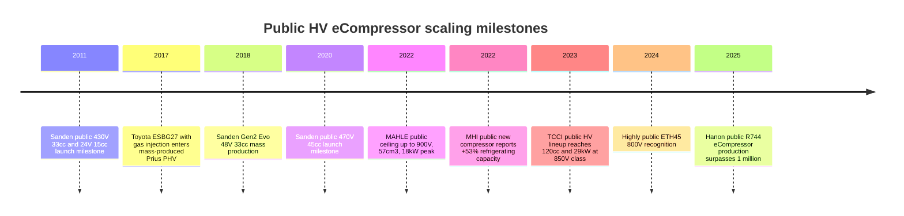

# Public Evolution of HV Electric Refrigerant Compressors

## Bottom line

Yes. The public record is strong enough to say that HV electric refrigerant compressors have, in aggregate, become more capable over the last decade—especially in **voltage class**, **displacement / cooling capacity**, and **system role**. The best-documented examples are Sanden’s roadmap from early 24 V / 430 V units toward 45 cc and 800 V classes, Toyota Industries’ progression from ESB20/27/34 to newer ESBG27 and ESH34/41 variants, MAHLE’s current public ceiling of **up to 900 V, up to 57 cm³, and 18 kW peak power**, Hanon’s move to **33 cc / 45 cc up to 800 V** plus R744/R290 programs, and TCCI’s explicit heavy-duty HV range from **34 cc / 8.5 kW** to **120 cc / 29 kW** at up to **850 V**. MHI’s public technical reviews also document a generational path from first-generation units in 2007 to newer designs with **+53% refrigerating capacity** at only **+13% compressor length**, plus a higher-voltage specification “twice as high as the current one.” citeturn22view1turn21view1turn28view0turn28view1turn26view0turn27search6turn13view0turn13view2turn29view1turn17view1

The evidence is strongest for **Passenger Car BEV/xEV** and **commercial / heavy-duty** segments. Passenger-car products now commonly sit in the **27–45 cc** range and increasingly support **400 V / 800 V** architectures; heavy-duty / bus / off-highway products extend to **45–120 cc**, **540–900 V** classes, and published cooling capacities in the **10–29 kW** class depending on test basis and refrigerant. At the same time, natural-refrigerant solutions have split the market: some **R744 / CO₂** compressors use much smaller geometrical displacement than R134a/R1234yf units, so “bigger” does not always mean “higher cc/rev” across refrigerants. citeturn23view1turn23view3turn23view4turn26view1turn29view1turn31search3turn6view3turn6view4turn34view1

## What the public sources show by target segment

For **Passenger Car BEV/xEV**, the public pattern is a move from smaller 20–34 cc classes toward broader 34–45 cc families, with explicit support for higher bus voltages and battery-cooling / heat-pump duty. Toyota Industries’ official portfolio now lists **ESB20, ESB27/34, ESBG27, and ESH34/41**, showing a company-level public evolution from 20 cc to 41 cc. Sanden’s official roadmap shows early 2011 introductions at **430 V / 33 cc** and **24 V / 15 cc**, then later **470 V / 33 cc**, **470 V / 45 cc**, and a planned **800 V / 45 cc** step. Valeo publicly states its current electrical-compressor range includes **34 cc 400 V**, **45 cc 400 V**, and **45 cc 800 V**. MAHLE publicly positions its compressor range at **up to 900 V** and **up to 57 cm³**, explicitly linking this to ultra-fast charging and application from passenger cars to heavy commercial vehicles. citeturn13view0turn22view1turn23view1turn28view0turn28view1

For **LCV, MD/HD Truck, Bus/Coach, and Off-highway**, the displacement and published cooling-capacity ceilings are clearly higher. TCCI’s official sales sheet is the cleanest public proof: its HV family spans **QPE34-400**, **QPE34-850**, **QPE46-850**, **QPE60-850**, and **QPE120-850**, with published cooling capacities from **8.5 kW** through **29 kW** and operation at **400–850 V**. SONGZ publicly lists **SZB66** at **66 cc**, **280–800 V**, and **15.2 kW** maximum cooling capacity, alongside smaller SZB, SZC, and SZA families for commercial-vehicle A/C and BTMS. Guchen publicly markets **34 cc / 900 V** construction-equipment compressors and lists other high-voltage commercial variants including **55 cc**, **66 cc**, and bus / truck applications. Aotecar’s public catalog extends to **E66A**, and Highly’s public material emphasizes passenger car, commercial vehicle, and bus applications plus a new **800 V ETH45** program. citeturn29view1turn6view3turn6view4turn35view0turn35view1turn34view0turn34view1turn31search3turn32search3turn33search3

For **natural-refrigerant and heat-pump-oriented systems**, the trend is not “ever larger displacement” in a simple way. Hanon publicly offers **R1234yf/R290** eCompressors in **33 cc and 45 cc** modular families up to **800 V**, plus an **R744 eCompressor** program and notes that its R744 eCompressor has surpassed **one million units**. Valeo publicly offers **R744 electrical compressors** and states an **8 cc 800 V** current product, while its R-744 Smart Heat Pump Dual page cites **R-744 EDC: 6 cc to 8 cc** and up to **11.5 kW** cooling for ultra-fast-charge use at +35 °C. Toyota Industries’ **ESBG27** is another important step because the public record ties it to **gas injection**, sub-zero EV-mode heating, and about **30% heating-capacity improvement** versus normal heat-pump heating. citeturn26view0turn26view1turn27search4turn27search12turn23view3turn23view4turn13view2turn14view0

## Why this is credible evidence for more powerful compressor generations

The most convincing evidence is not a single headline number. It is the combination of three recurring public signals.

First, **HV class has moved upward**, especially where fast charging and larger thermal loads matter. Sanden’s public range now reaches **800 V**; Valeo lists **45 cc 800 V** and **R744 8 cc 800 V**; Hanon mentions **up to 800 V** and publicly references an industry-first 800 V compressor; TCCI’s HV range reaches **850 V**; Guchen markets **900 V** units; MAHLE states **up to 900 V**. That is a clear public shift away from older ~200–470 V classes alone. citeturn21view1turn23view1turn23view3turn26view0turn27search6turn29view1turn34view1turn28view1

Second, **published size and output ceilings have risen in many segments**. Sanden’s official line moved from smaller SHS33-era products toward current 45 cc / 10 kW classes. Toyota’s public lineup now reaches **41 cc**. MAHLE publicly claims **57 cm³** and **18 kW peak**. TCCI publishes a step up to **120 cc / 29 kW** for HV heavy-duty applications. SONGZ publicly lists **66 cc / 15.2 kW**; Guchen publicly lists **66 cc / 600 V** bus / BTMS products and case data for 900 V crane BTMS use. MHI’s public reviews show an internal generational climb in refrigerating capacity and higher-voltage specification, even when commercial model numbers are not disclosed. citeturn21view0turn21view1turn13view0turn28view1turn29view1turn6view3turn34view0turn34view2turn17view1

Third, **the compressor’s role widened**, which is exactly what one would expect if the “Kältekreis” is getting thermally more demanding. Across MAHLE, Valeo, Hanon, Sanden, Toyota, MHI, and TCCI, the public language has shifted from cabin A/C only toward **battery cooling**, **power-electronics cooling**, **combined cabin + battery cooling**, **heat pump**, **vapor injection / gas injection**, and **support for ultra-fast charging**. That is not just marketing language; it is a system-level explanation for why higher voltage, higher refrigerating capacity, and larger product families appear in the public product record. citeturn28view0turn23view1turn26view0turn26view2turn22view1turn13view2turn17view0turn29view0

## Data quality and key gaps

The **highest-confidence manufacturer-level public data** came from official product tables and brochures by **Sanden, Toyota Industries, TCCI, Aotecar, SONGZ, and ESTRA**. These sources publish numerical values such as displacement, voltage, speed, weight, and sometimes cooling capacity or test conditions. **Valeo** also publishes useful current product-family values, though some variant-level details are lighter on exact tables. **MAHLE** and **Hanon** are credible on trend direction and product positioning, but much of the public evidence comes from official press / product pages rather than full datasheets. **MHI** offers very credible technical reviews, but some products are discussed by generation rather than explicit commercial model code. citeturn21view0turn21view1turn13view0turn29view1turn31search3turn6view3turn6view4turn6view5turn23view1turn28view1turn26view0turn17view1

The weakest parts of the public record are the ones you would most want for a clean cross-OEM comparison: **continuous electrical power**, **peak electrical power**, **heating capacity on compressor-only basis**, **exact refrigerant-side test conditions**, and **precise public launch year for every variant**. Bosch, DENSO, Highly, Subros, and some MHI / Hanon entries are publicly visible, but often only at family or strategic-program level rather than a full model datasheet. For those manufacturers, a rigorous longitudinal plot is still possible, but it must either accept blanks or separate high-confidence rows from family-level / program-level rows. citeturn9search0turn37view0turn33search3turn36search0turn36search9turn17view1turn26view0

The key methodological caution is this: **do not compare cooling-capacity numbers without preserving test-condition metadata**. Sanden, TCCI, SONGZ, ESTRA, and others use different standards or reported condition sets; Valeo and Hanon sometimes state system role but not compressor-only points; CO₂ / R744 products are not directly comparable to R134a / R1234yf products by displacement alone. That is why a separate `ecompressor_test_conditions.csv` is essential. citeturn21view0turn21view1turn29view1turn6view3turn6view4turn6view5turn23view4

## CSV-ready structured datasets

The three machine-ready CSVs below are **best-effort normalized extracts** from the public sources gathered here. Empty fields are intentionally left blank where the public source did not publish a value.

## Visualization ideas

The cleanest way to visualize this dataset is to **separate segment logic from raw horsepower logic**.

A good first chart is **max voltage vs. public year**, faceted by target segment. That will show the migration from ~200–470 V classes to 800–900 V classes in passenger-car and heavy-duty applications. A second chart should be **displacement vs. published cooling capacity**, colored by refrigerant; this prevents CO₂ compressors from being misread as “small / weak” when they are simply on a different thermodynamic basis. A third chart should be **manufacturer timeline of public milestones**, using only high-confidence rows (`source_quality = A` or `B`). The fourth should be a **bubble chart of voltage_max_vdc vs displacement_cc_rev**, with bubble size = cooling_capacity_kw and shape = target segment. Those four together are enough to answer the original question robustly. citeturn22view1turn29view1turn13view0turn28view1turn23view4

A compact Mermaid timeline for the public milestone story:



A sample Vega-Lite scatter configuration:

```json
{
  "$schema": "https://vega.github.io/schema/vega-lite/v5.json",
  "data": {"url": "ecompressor_products.csv"},
  "transform": [
    {"filter": "datum.voltage_max_vdc != null"},
    {"filter": "datum.displacement_cc_rev != null"}
  ],
  "mark": {"type": "circle", "tooltip": true},
  "encoding": {
    "x": {"field": "voltage_max_vdc", "type": "quantitative", "title": "Max voltage [Vdc]"},
    "y": {"field": "displacement_cc_rev", "type": "quantitative", "title": "Displacement [cc/rev]"},
    "size": {"field": "cooling_capacity_kw", "type": "quantitative", "title": "Cooling capacity [kW]"},
    "color": {"field": "target_segments", "type": "nominal", "title": "Target segment"},
    "shape": {"field": "refrigerant", "type": "nominal", "title": "Refrigerant"},
    "opacity": {"value": 0.8}
  }
}
```

## Open questions and limitations

The public evidence is good enough to support the conclusion that **compressor capability has generally increased**, but not good enough to produce a perfectly homogeneous OEM-to-OEM benchmark. The main unresolved items are **continuous electrical power**, **compressor-only heating capacity**, **detailed refrigerant-side test conditions**, **public SOP year for every variant**, and **variant-level public tables for Bosch, DENSO, Highly, Subros, and some MHI programs**. If you want a publication-grade trend plot, I would treat the current extract as a **high-confidence core dataset plus medium-confidence perimeter**, and I would always keep the `source_quality` and `confidence` fields visible in the analysis. citeturn9search0turn37view0turn33search3turn36search0turn17view1